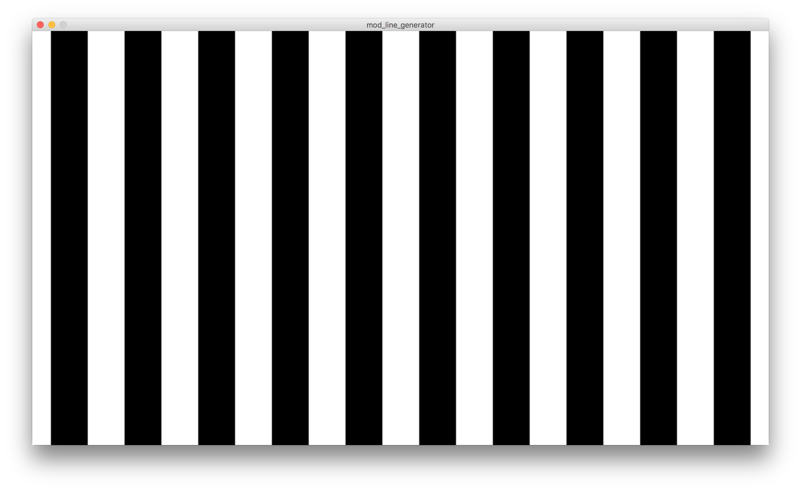

# MOD. line generator

A line generator written in [Processing](https://processing.org).

This is a minimal version to test vsync problems.

## TODO:

* Check how this works on final hardware.

## License

Released under an [MIT License](LICENSE).

Written by @xiq